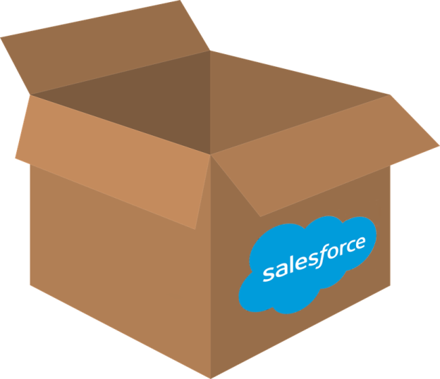

  
  <h1>My DevHub Application</h1>
  

    <b>My DevHub Application</b> allows you to list the subscribers of your package(s) from your dev hub environment with two views: package-focused and customer-focused.
  

  
  
  
  
  

## Deploy to Salesforce (production and developer edition)

## What's inside?

- 2 Custom Tab: MySubscribers and MyCustomers
- 2 Visual Force Page: MySubscribers and MyCustomers
- 2 Apex Controller Class: MySubscribersController and MyCustomersController
- 1 Permission Set: access to page/tab/class for assigned user
- 1 Custom App: My DevHub Application

## The package-focused tab

A page called "MySubscribers", to be installed in your dev hub, to list the package/version that your subscribers are using.

For older versions of the same package, the page includes a script to copy and paste into a terminal to push the new versions to subscribers.

## The customer-focused tab

A page called "MyCustomers" to list all customers and the org where your package is installed (whatever the package)

## Deploy to Salesforce (production and developer edition)

## Issues or new ideas?

You can log any issues and new ideas in our tracker: https://github.com/VinceFINET/MyDevHubApplication/issues

## License

<b>My DevHub Application</b> is available under the [MIT license](LICENSE.md)
